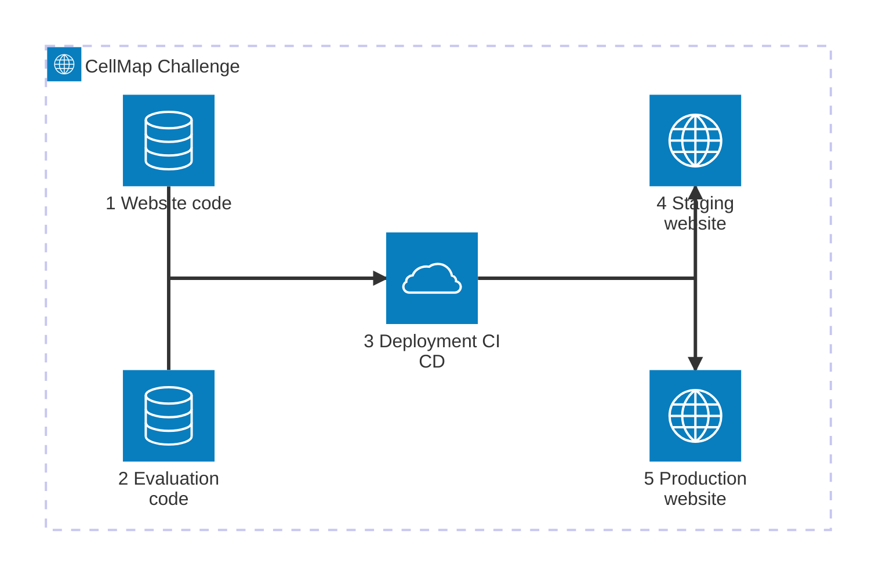

# Frictionless Data Exchanges (FRX) for data challenges

This project is a fork of the upstream project [2i2c-org/frx-challenges](https://github.com/2i2c-org/frx-challenges), which is an open source repository that provides key software components for running competitive data science challenges.

FRX stands for Frictionless Reproducibility eXchange. Inspired by Donoho, 2023. This project enables communities to host data challenges with live evaluation. It is designed to be run either on local infrastructure, or via cloud-hosted infrastructure.

## Contributing

Upstream contributions should be made back to the [FRX Challenges](https://github.com/2i2c-org/frx-challenges) framework where possible in a way that preserves flexibility for general audiences to reuse the framework.

## Technical details

The CellMap Challenge website is based on the general open-source framework provided by the upstream [FRX Challenges](https://2i2c.org/frx-challenges/) (**F**rictionless **R**eproducibility e**X**change) project, designed for running competitive data science challenges (see Figure A1). This means that the Janelia CellMap Project Team can develop and contribute their own open-source plugins to customize their own version of the challenge website downstream.

The Janelia team maintains the [janelia-cellmap/cellmap-segmentation-challenge](https://github.com/janelia-cellmap/cellmap-segmentation-challenge) GitHub repository, which defines the evaluation mechanism for scoring challenge submissions (see Figure A2).

Website customizations and evaluator settings are configured and applied downstream during deployment, which is version-controlled and managed with Continuous Integration/Continuous Deployment (CI/CD) best practices at the [2i2c-org/frx-challenges-deploy](https://github.com/2i2c-org/frx-challenges-deploy) GitHub repository (see Figure A3).

The website deployment is released to a production environment (see Figure A5) hosted on Google Cloud Platform (GCP) that 2i2c operates and maintains. There is also a staging environment for testing any changes or updates before rolling out to production (see Figure A4).



_Figure A: CellMap Challenge architecture diagram._

## Workflow

### Image building and helm charts

Pushing changes to this repository will trigger the following

- an image build that is pushed to [quay.io](https://quay.io/repository/2i2c/janelia-frx-challenges?tab=tags)
- a helm chart release that is published at [janelia-cellmap.github.io/frx-challenges/](https://janelia-cellmap.github.io/frx-challenges/).

### Updating the staging website

To stage website changes from a helm chart release to the staging environment, make a note of the desired [helm chart release](https://janelia-cellmap.github.io/frx-challenges/) version, which is of the form

```bash
0.0.1-0.dev.git.537.h8898fa7
```

Then, open a pull request against the [2i2c-org/frx-challenges-deploy](https://github.com/2i2c-org/frx-challenges-deploy) repository and update the `app/staging/staging.values.yaml` file, update the `image.tag` field to the latest helm chart version:

```yaml
frx-challenges:
  image:
    repository: quay.io/2i2c/janelia-frx-challenges
    tag: 0.0.1-0.dev.git.<update-image-tag>
```

After merging the pull request, the staging website will be updated with the latest changes.

### Updating the production website

When you are happy with the updates to the staging website, open a pull request and update the `app/Chart.yaml` file such that

```yaml
dependencies:
  - name: frx-challenges
    version: 0.0.1-0.dev.git.<update-image-tag>
    repository: https://janelia-cellmap.github.io/frx-challenges/
```

This will automatically request a review from a 2i2c.org team member, and will be merged into the production website once approved.
